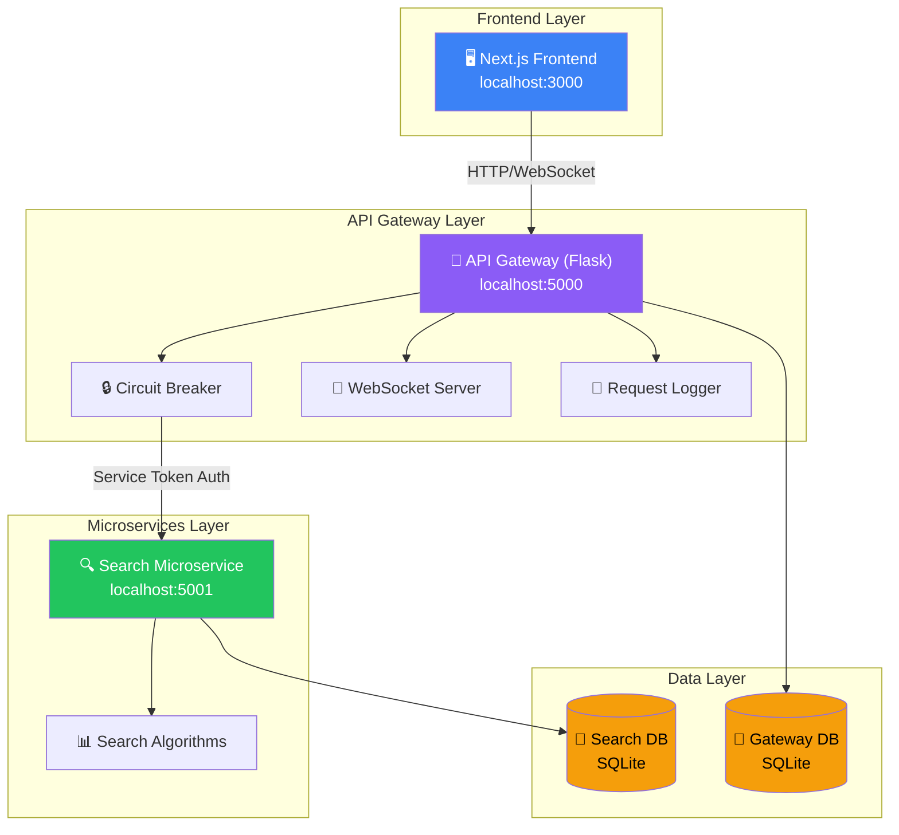
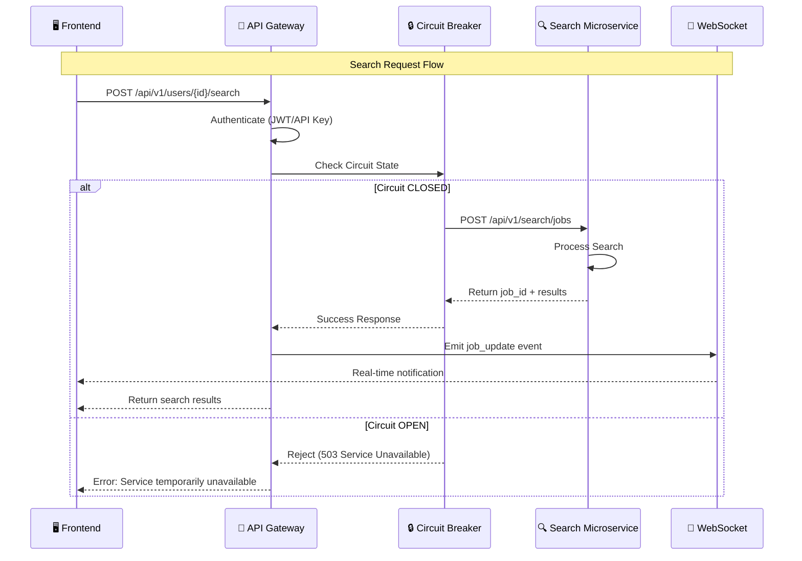
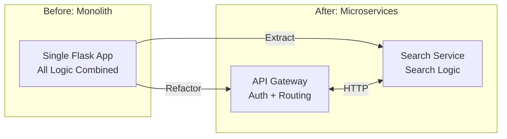
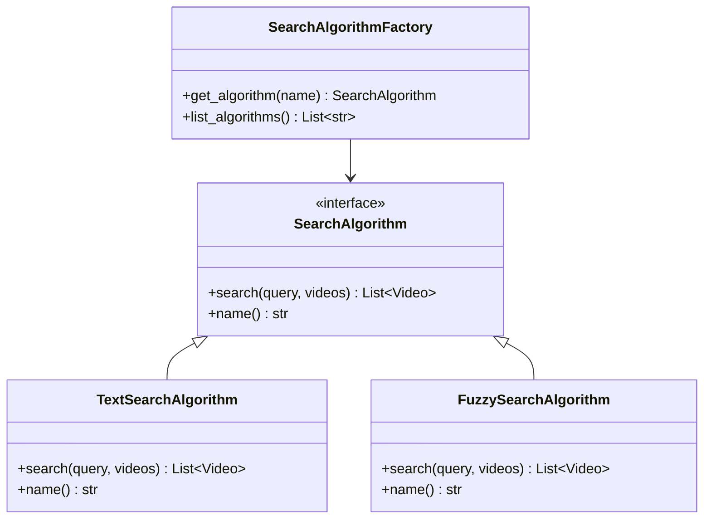
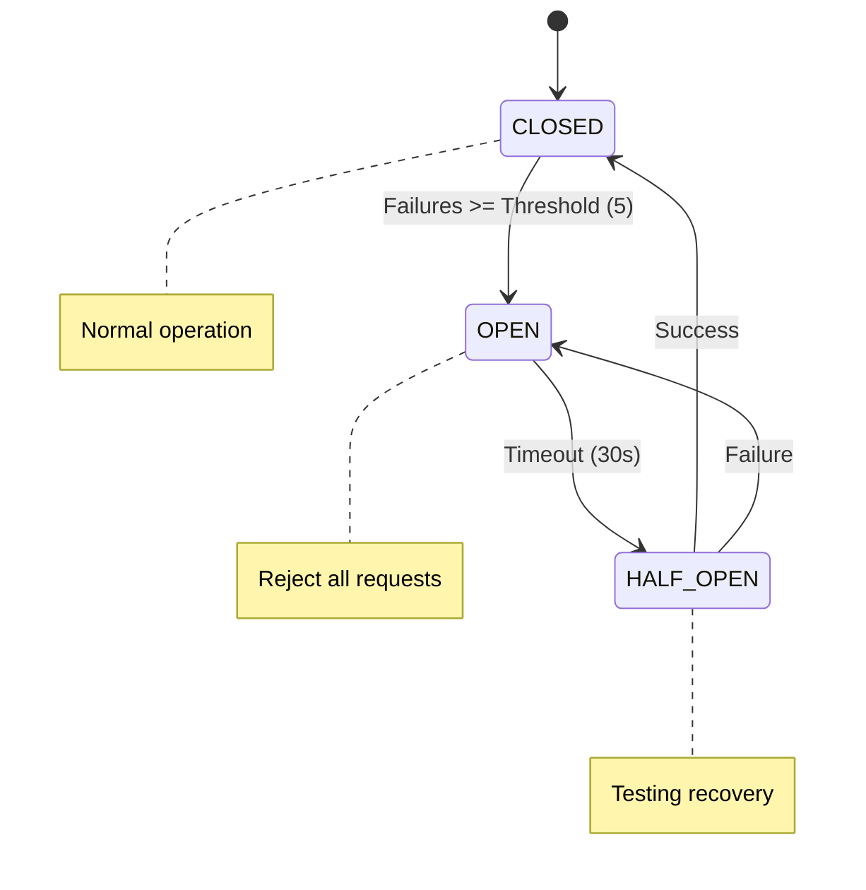

# 🎬 Video Search Platform - Microservices Architecture

> A production-ready video search platform refactored from a monolith to microservices architecture, featuring an API Gateway, Search Microservice, and comprehensive Developer Dashboard.

[](docker-compose.yml)
[](http://localhost:5000/api/docs/)
[](tests/)

---

## 📋 Table of Contents

- [Architecture Overview](#-architecture-overview)
- [Project Structure](#-project-structure)
- [Quick Start](#-quick-start)
- [Running Tests](#-running-tests)
- [API Documentation](#-api-documentation)
- [Design Decisions](#-design-decisions)
- [Features Implemented](#-features-implemented)
- [Bonus Features (9/9)](#-bonus-features-99-)
- [Environment Variables](#-environment-variables)
- [Improvements for Production](#-improvements-for-production)

---

## 🏗️ Architecture Overview

### High-Level Architecture Diagram



### Service Communication Flow



### Text Architecture Diagram

```
┌─────────────────────────────────────────────────────────────────────────────┐
│                         Frontend (Next.js)                                   │
│                         http://localhost:3000                                │
│   ┌────────────────┐  ┌─────────────────────┐  ┌────────────────────────┐   │
│   │ Video Library  │  │ Developer Dashboard │  │ API Key Management     │   │
│   │ • CRUD Videos  │  │ • Analytics Charts  │  │ • Create/Delete Keys  │   │
│   │ • Search       │  │ • Job Tracking      │  │ • Usage Statistics    │   │
│   └────────────────┘  └─────────────────────┘  └────────────────────────┘   │
└─────────────────────────────────────────────────────────────────────────────┘
                                     │
                                     │ HTTP + WebSocket
                                     ▼
┌─────────────────────────────────────────────────────────────────────────────┐
│                        API Gateway (Flask)                                   │
│                        http://localhost:5000                                 │
│                                                                              │
│  ┌──────────────┐  ┌──────────────┐  ┌──────────────┐  ┌──────────────┐    │
│  │ Auth (JWT)   │  │ Circuit      │  │ WebSocket    │  │ Request      │    │
│  │ + API Keys   │  │ Breaker      │  │ (SocketIO)   │  │ Logger       │    │
│  └──────────────┘  └──────────────┘  └──────────────┘  └──────────────┘    │
│                                                                              │
│  Endpoints: /auth, /users, /videos, /search, /analytics, /api-keys          │
└─────────────────────────────────────────────────────────────────────────────┘
                                     │
                                     │ HTTP + Service Token
                                     ▼
┌─────────────────────────────────────────────────────────────────────────────┐
│                    Search Microservice (Flask)                               │
│                    http://localhost:5001                                     │
│                                                                              │
│  ┌──────────────────────────────────────────────────────────────────────┐   │
│  │                    Search Algorithms (Strategy Pattern)               │   │
│  │  ┌─────────────────────┐         ┌─────────────────────┐             │   │
│  │  │ TextSearchAlgorithm │         │ FuzzySearchAlgorithm│             │   │
│  │  │ (Keyword matching)  │         │ (Typo-tolerant)     │             │   │
│  │  └─────────────────────┘         └─────────────────────┘             │   │
│  └──────────────────────────────────────────────────────────────────────┘   │
│                                                                              │
│  Endpoints: /search/jobs, /search/jobs/{id}, /health                         │
└─────────────────────────────────────────────────────────────────────────────┘
```

---

## 📁 Project Structure

```
imaginario-video-search-platform/
├── api-gateway/                    # 🔀 API Gateway service
│   ├── app.py                     # Main Flask app (1300+ lines)
│   │   ├── Models (User, Video, APIKey, APIRequestLog)
│   │   ├── Circuit Breaker implementation
│   │   ├── WebSocket events (Flask-SocketIO)
│   │   ├── All REST endpoints
│   │   └── Analytics & logging middleware
│   ├── requirements.txt           # Python dependencies
│   └── Dockerfile                 # Container configuration
│
├── search-microservice/            # 🔍 Search microservice
│   ├── app.py                     # Search job processing
│   ├── search_algorithms.py       # Strategy pattern implementation
│   │   ├── SearchAlgorithm (Abstract base)
│   │   ├── TextSearchAlgorithm
│   │   ├── FuzzySearchAlgorithm
│   │   └── SearchAlgorithmFactory
│   ├── requirements.txt           # Python dependencies
│   └── Dockerfile                 # Container configuration
│
├── starter-frontend/               # 🖥️ Next.js frontend
│   ├── pages/
│   │   ├── index.tsx              # Video library dashboard
│   │   ├── developer-dashboard.tsx # Developer analytics (700+ lines)
│   │   ├── api-keys.tsx           # API key management
│   │   ├── login.tsx              # Authentication
│   │   └── register.tsx           # User registration
│   ├── lib/
│   │   ├── api.ts                 # Axios API client
│   │   ├── store.ts               # Redux store
│   │   ├── hooks/
│   │   │   └── useWebSocket.ts    # WebSocket hook for real-time
│   │   └── slices/                # Redux slices
│   │       ├── authSlice.ts
│   │       ├── videoSlice.ts
│   │       ├── analyticsSlice.ts
│   │       └── apiKeySlice.ts
│   ├── package.json               # NPM dependencies
│   └── Dockerfile                 # Container configuration
│
├── tests/                          # 🧪 Unit tests
│   ├── test_search_microservice.py # Search service tests
│   ├── test_api_gateway.py        # Gateway tests
│   └── requirements.txt           # Test dependencies
│
├── docker-compose.yml              # 🐳 Docker orchestration
├── ASSIGNMENT.md                   # Original assignment
└── README.md                       # This file
```

---

## 🚀 Quick Start

### Option 1: Docker Compose (Recommended)

```bash
# Clone the repository
git clone https://github.com/YOUR_USERNAME/imaginario-video-search-platform.git
cd imaginario-video-search-platform

# Start all services
docker-compose up --build

# Services will be available at:
# - Frontend:       http://localhost:3000
# - API Gateway:    http://localhost:5000
# - Swagger Docs:   http://localhost:5000/api/docs/
# - Search Service: http://localhost:5001
```

### Option 2: Manual Setup

#### 1. Start Search Microservice (Terminal 1)
```bash
cd search-microservice
python -m venv venv
venv\Scripts\activate      # Windows
# source venv/bin/activate # Linux/Mac
pip install -r requirements.txt
python app.py
# ✅ Runs on http://localhost:5001
```

#### 2. Start API Gateway (Terminal 2)
```bash
cd api-gateway
python -m venv venv
venv\Scripts\activate      # Windows
# source venv/bin/activate # Linux/Mac
pip install -r requirements.txt
set SEARCH_MICROSERVICE_URL=http://localhost:5001   # Windows
# export SEARCH_MICROSERVICE_URL=http://localhost:5001  # Linux/Mac
python app.py
# ✅ Runs on http://localhost:5000
```

#### 3. Start Frontend (Terminal 3)
```bash
cd starter-frontend
npm install
npm run dev
# ✅ Runs on http://localhost:3000
```

---

## 🧪 Running Tests

```bash
cd tests
pip install -r requirements.txt
pip install -r ../search-microservice/requirements.txt
pip install -r ../api-gateway/requirements.txt

# Run all tests
pytest -v

# Run specific test files
pytest test_search_microservice.py -v
pytest test_api_gateway.py -v

# Run with coverage
pytest --cov=. --cov-report=html
```

### Test Coverage

| Component | Tests | Coverage |
|-----------|-------|----------|
| Search Microservice | 8+ tests | Search algorithms, job management |
| API Gateway | 10+ tests | Auth, routing, circuit breaker |

---

## 📚 API Documentation

### Interactive Documentation

Swagger UI available at: **http://localhost:5000/api/docs/**

### Authentication Endpoints

| Method | Endpoint | Description |
|--------|----------|-------------|
| `POST` | `/api/v1/auth/register` | Register new user |
| `POST` | `/api/v1/auth/login` | Login and get JWT token |
| `POST` | `/api/v1/auth/api-keys` | Create API key |
| `GET` | `/api/v1/auth/api-keys` | List API keys |
| `DELETE` | `/api/v1/auth/api-keys/<id>` | Delete API key |

### Video Endpoints

| Method | Endpoint | Description |
|--------|----------|-------------|
| `GET` | `/api/v1/users/<id>/videos` | List user's videos |
| `POST` | `/api/v1/users/<id>/videos` | Create video |
| `GET` | `/api/v1/users/<id>/videos/<vid>` | Get video details |
| `PUT` | `/api/v1/users/<id>/videos/<vid>` | Update video |
| `DELETE` | `/api/v1/users/<id>/videos/<vid>` | Delete video |

### Search Endpoints

| Method | Endpoint | Description |
|--------|----------|-------------|
| `POST` | `/api/v1/users/<id>/search` | Submit search job |
| `GET` | `/api/v1/users/<id>/search/<job_id>` | Get search results |
| `GET` | `/api/v1/search/jobs` | List all search jobs |
| `GET` | `/api/v1/search/jobs/<id>/details` | Get job details |
| `POST` | `/api/v1/search/jobs/<id>/retry` | Retry failed job |
| `POST` | `/api/v1/search/jobs/<id>/cancel` | Cancel running job |

### Analytics Endpoints (Developer Dashboard)

| Method | Endpoint | Description |
|--------|----------|-------------|
| `GET` | `/api/v1/analytics/usage` | Get usage statistics |
| `GET` | `/api/v1/analytics/usage/daily` | Daily usage breakdown |
| `GET` | `/api/v1/analytics/usage/endpoints` | Usage by endpoint |
| `GET` | `/api/v1/auth/api-keys/<id>/usage` | API key usage stats |
| `GET` | `/api/v1/auth/api-keys/<id>/usage/daily` | Daily usage per key |

### System Endpoints

| Method | Endpoint | Description |
|--------|----------|-------------|
| `GET` | `/health` | Health check with dependencies |
| `GET` | `/api/v1/system/circuit-breaker` | Circuit breaker status |

---

## 🎯 Design Decisions

### 1. Microservices Architecture



**Decision:** Extract search functionality into a separate microservice while keeping the API Gateway as the main entry point.

**Rationale:**
- **Separation of Concerns:** Search operations are isolated, easier to scale and maintain
- **Fault Isolation:** Search service failures don't affect other API operations
- **Independent Scaling:** Search service can scale horizontally based on load
- **Technology Flexibility:** Search algorithms can be changed without affecting gateway

**Trade-off:** Added complexity in deployment and inter-service communication, but gained scalability and maintainability.

---

### 2. Strategy Pattern for Search Algorithms



**Decision:** Implement search algorithms using the Strategy pattern with a factory for instantiation.

**Rationale:**
- **Extensibility:** New algorithms can be added without modifying existing code
- **Open/Closed Principle:** System is open for extension, closed for modification
- **Runtime Flexibility:** Algorithms can be selected at runtime via API parameter
- **Testability:** Each algorithm can be tested in isolation

**Current Algorithms:**
- `TextSearchAlgorithm` - Keyword-based text matching (default)
- `FuzzySearchAlgorithm` - Typo-tolerant fuzzy matching

---

### 3. Circuit Breaker Pattern



**Decision:** Implement a circuit breaker for Search Microservice calls.

**Configuration:**
- Failure threshold: 5 consecutive failures
- Recovery timeout: 30 seconds
- Half-open max calls: 3 test requests

**Rationale:**
- **Resilience:** Prevents cascade failures when search service is down
- **Fast Failure:** Returns 503 immediately instead of waiting for timeouts
- **Self-Healing:** Automatically recovers when service comes back

---

### 4. Service-to-Service Authentication

**Decision:** Use a shared service token for internal communication.

```bash
# API Gateway → Search Microservice
X-Service-Token: service-secret-token-change-in-production
```

**Rationale:**
- **Security:** Prevents unauthorized direct access to microservices
- **Simplicity:** Token-based auth is simple to implement and verify
- **Performance:** No additional auth service calls needed

**Trade-off:** Shared secret is simpler but less secure than mTLS. In production, consider mTLS or JWT-based service auth.

---

### 5. Request Logging for Analytics

**Decision:** Log all API requests in the API Gateway with response times and status codes.

**Implementation:**
```python
class APIRequestLog(db.Model):
    endpoint = db.Column(db.String(200))
    method = db.Column(db.String(10))
    status_code = db.Column(db.Integer)
    response_time_ms = db.Column(db.Integer)
    timestamp = db.Column(db.DateTime)
    user_id = db.Column(db.Integer, ForeignKey)
    api_key_id = db.Column(db.String, ForeignKey)
```

**Rationale:**
- **Observability:** Enables detailed analytics for Developer Dashboard
- **Performance Monitoring:** Response time tracking helps identify bottlenecks
- **Usage Tracking:** Per-endpoint and per-API-key usage statistics

---

### 6. WebSocket for Real-time Notifications

**Decision:** Implement WebSocket support using Flask-SocketIO for real-time job status updates.

**Events:**
| Event | Direction | Purpose |
|-------|-----------|---------|
| `connect` | Client→Server | Initial connection |
| `authenticate` | Client→Server | JWT authentication |
| `subscribe_jobs` | Client→Server | Subscribe to job updates |
| `job_update` | Server→Client | Job status changed |
| `analytics_update` | Server→Client | New analytics available |

**Rationale:**
- **Real-time UX:** Users see job status changes instantly
- **Reduced Polling:** Less server load compared to polling
- **Fallback:** Polling still works if WebSocket unavailable

---

## 🏆 Features Implemented

### ✅ Core Requirements (100%)

| Requirement | Status | Details |
|-------------|--------|---------|
| Search Microservice | ✅ | Separate Flask app with extensible algorithms |
| API Gateway | ✅ | Routes requests, handles auth, maintains compatibility |
| Service Communication | ✅ | HTTP REST with service token authentication |
| Error Handling | ✅ | Circuit breaker, graceful degradation |
| Developer Dashboard | ✅ | Analytics, job tracking, API key insights |
| Real-time Updates | ✅ | WebSocket + polling fallback |
| Data Visualization | ✅ | Charts using Recharts |

### ✅ Developer Dashboard Features

| Feature | Status | Details |
|---------|--------|---------|
| API Usage Analytics | ✅ | Total requests, success rate, response times |
| Daily Usage Charts | ✅ | Line charts with trends |
| Endpoint Breakdown | ✅ | Bar chart per endpoint |
| Search Job Tracking | ✅ | Real-time status, filters, pagination |
| Job Retry/Cancel | ✅ | Action buttons in UI |
| API Key Insights | ✅ | Per-key usage statistics |
| Export Data | ✅ | CSV/JSON download |

---

## 🌟 Bonus Features (9/9 ✅)

| # | Feature | Status | Implementation |
|---|---------|--------|----------------|
| 1 | Docker Compose | ✅ | `docker-compose.yml` orchestrates all 3 services |
| 2 | Comprehensive Tests | ✅ | `tests/` folder with pytest |
| 3 | Swagger/OpenAPI | ✅ | Flasgger at `/api/docs/` |
| 4 | Circuit Breaker | ✅ | `CircuitBreaker` class with 3 states |
| 5 | Advanced Analytics | ✅ | Charts, trends, P95 response times |
| 6 | Export CSV/JSON | ✅ | Download buttons in dashboard |
| 7 | Job Retry/Cancel | ✅ | REST endpoints + UI buttons |
| 8 | Request Logging | ✅ | `APIRequestLog` model + middleware |
| 9 | WebSockets | ✅ | Flask-SocketIO + socket.io-client |

### WebSocket Details

The platform implements real-time notifications:

**Backend (Flask-SocketIO):**
```python
@socketio.on('authenticate')
def handle_authenticate(data):
    token = data.get('token')
    # Verify JWT and join user room
    join_room(f'user_{user_id}')
```

**Frontend (useWebSocket hook):**
```typescript
const { isConnected, lastNotification } = useWebSocket(token);
// Shows "● Live" indicator when connected
```

---

## 📝 Environment Variables

### API Gateway

| Variable | Description | Default |
|----------|-------------|---------|
| `SEARCH_MICROSERVICE_URL` | URL of search service | `http://localhost:5001` |
| `SERVICE_TOKEN` | Service-to-service auth token | `service-secret-token...` |
| `DATABASE_URL` | Database connection | `sqlite:///videos.db` |
| `JWT_SECRET` | JWT signing secret | `your-secret-key...` |
| `SECRET_KEY` | Flask session secret | `websocket-secret...` |

### Search Microservice

| Variable | Description | Default |
|----------|-------------|---------|
| `SERVICE_TOKEN` | Expected auth token | `service-secret-token...` |
| `DATABASE_URL` | Database connection | `sqlite:///search_jobs.db` |
| `PORT` | Service port | `5001` |

### Frontend

| Variable | Description | Default |
|----------|-------------|---------|
| `NEXT_PUBLIC_API_URL` | API Gateway URL | `http://localhost:5000` |

---

## 👤 Author

**Aymen Mabrouk**

Built as part of the **Imaginario Fullstack Developer Internship Technical Assessment**.
